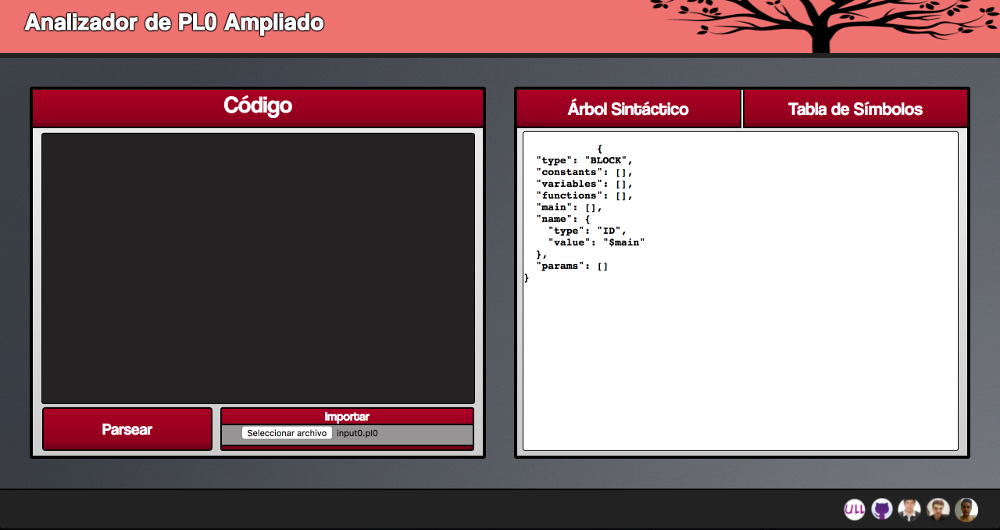

# ESIT ULL Grado de Informática
## PROCESADORES DE LENGUAJES. Implementación de un analizador de PL0 en PEGjs.
### Realizada por Eduardo Escobar Alberto y Alejandro Marrero Díaz.

#### Enlaces de interés

* [Despliegue en Heroku](https://pl0-parser-eda.herokuapp.com/)
* [PL0](https://en.wikipedia.org/wiki/Recursive_descent_parser)
* [PEGJS](http://pegjs.org/)

A continuación se pasará a explicar con detalles las características del analizador así como la sintaxis aceptada para cada tipo de sentencia y/o expresión definida en el lenguaje.

##### Estructura principal del programa

```js
program
  = block
```

##### Bloques de programa

```js
block
  = constantDeclaration? variableDeclaration? functionDeclaration* statement*
```

##### Declaración de constantes

```js
constantDeclaration
  = CONST ID ASSIGN NUMBER (COMMA ID ASSIGN NUMBER)* SEMICOLON
```

##### Declaración de variables

```js
variableDeclaration
  = VAR ID ASSIGN? factor? (COMMA ID ASSIGN? factor?)* SEMICOLON
```

##### Funciones anónimas

```js
anonymousFunction
  = LEFTPAR factor? (COMMA factor)* RIGHTPAR ARROW CL block CR
```

##### Declaración de funciones con identificador

```js
functionDeclaration
  = FUNCTION ID LEFTPAR !COMMA ID? (COMMA ID)* RIGHTPAR CL block CR SEMICOLON
```

##### Sentencias

```js
statement
  = CL statement? (SEMICOLON statement)* SEMICOLON* CR

  / IF assign THEN statement ELSE statement

  / IF assign THEN statement

  / WHILE assign DO statement

  / FOR LEFTPAR assign SEMICOLON condition SEMICOLON statement RIGHTPAR statement

  / RETURN assign?
  / assign
```

##### Asignaciones

```js
assign
  = ID ASSIGN anonymousFunction

  / ID ASSIGN string

  / (ID array) ASSIGN condition
  / ID ASSIGN condition
  / condition
```

##### Condiciones

```js
condition
  = exp COND exp
  /	exp
```

##### Expresiones

```js
exp
  = term   (ADD term)*
```

##### Términos

```js  
term
  = factor (MUL factor)*
```

##### Factores

```js
factor
  = NUMBER
  / ID LEFTPAR assign? (COMMA assign)* RIGHTPAR
  / ID
  / LEFTPAR assign RIGHTPAR
  / array
```

##### Arrays
```js
array
  = LEFTSQBR assign? (COMMA assign)* RIGHTSQBR
```
##### Cadenas de literales

```js
string
  = QM STRING QM
```

##### TOKENS

```js
 _ "( \t\n\r)"     = $[ \t\n\r]*
 COND "condition"  =	_ ("=="/"!="/"<="/">="/"<"/">") _  
 ASSIGN            = _ '=' _
 ADD "operator"    = _ [+-] _
 MUL "operator"    = _ [*/] _
 LEFTPAR           = _"("_
 RIGHTPAR          = _")"_
 LEFTSQBR          = _"["_
 RIGHTSQBR         = _"]"_
 CL                = _"{"_
 CR                = _"}"_
CONST             = _ "const" _
VAR               = _ "var" _
FUNCTION          = _ "function" _
IF                = _ "if" _
THEN              = _ "then" _
ELSE              = _ "else" _
WHILE             = _ "while" _
DO                = _ "do" _
FOR               = _ "for" _
RETURN            = _ "return" _
SEMICOLON         = _";"_
COMMA             = _","_
ARROW             = _ "=>" _
QM                = _ '"' _
STRING            = _ ([a-zA-Z0-9_ ]*)_
ID "identifier"   = _ $([a-zA-Z_][a-zA-Z_0-9]*) _
NUMBER "number"   = _ $[0-9]+ _
```
#### INTERFAZ GRÁFICA DEL ANALIZADOR

